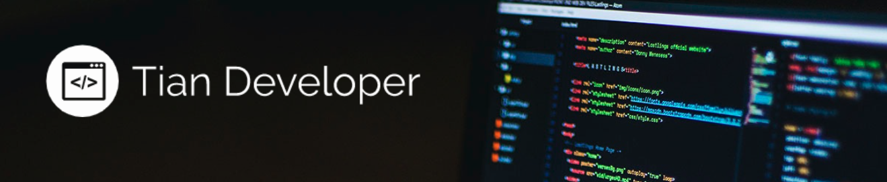

# Hi there, I'm Cristian Arevalo 👋

Full Stack Web Developer
-------------------

I’m a systems engineer and fullstack developer with over 3 years of experience in software development.

I am passionate about creating efficient and scalable solutions that make a real impact on users and businesses. Throughout my career, I have worked on projects covering both frontend and backend, using modern technologies to build robust, secure, and high-performance applications.

## Key Qualities

Here are some qualities that define my professional approach:

- 📈 **Dedication:** Always focused on achieving my goals and delivering high-quality results.  
- 📚 **Continuous learning:** I strive to improve every day and stay updated with best practices.  
- 🤝 **Teamwork:** I believe collaboration is key to maximizing effectiveness and generating stronger results.  
- 💬 **Empathy and communication:** I value the importance of understanding the needs of both users and colleagues to create more efficient solutions.

## Skills

- Frontend: HTML, CSS, JavaScript, React, Angular
- Backend: Node.js, Express, Python, Django
- Databases: MongoDB, MySQL, PostgreSQL
- Version Control: Git, GitHub
- Tools: Docker, AWS, Firebase, Jenkins

## Contact

Feel free to reach out if you’d like to collaborate or if you have any questions!

- LinkedIn: [Your LinkedIn URL]
- GitHub: [Your GitHub URL]
- Email: [Your Email]
